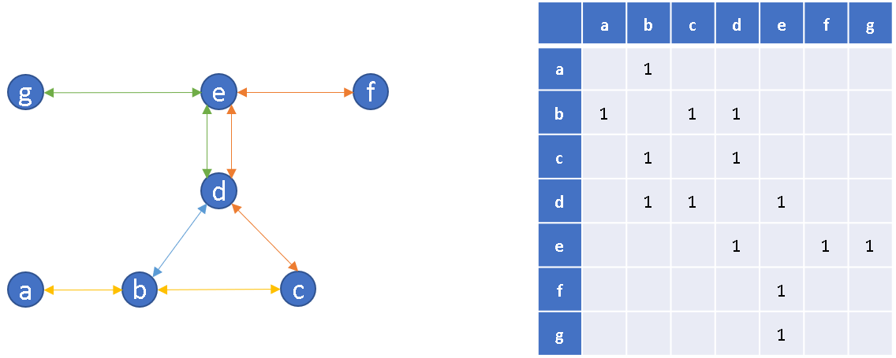

# thundera
## Análise de frequencia de passageiros

### Problema: 
Durante a pandemia, deve-se garantir o distanciamento social e em momentos de rush há um risco potencial de transmissão nas viagens. 
Usuários irão trocar de meio de transporte por medo da lotação.  Assim, o problema é como operações e comunicação poderá garantir a qualidade de serviço e espaçamento social em momentos de rush. 
Por exemplo, um passageiro às 16h, sem saber se haverá condições de distanciamento, poderá optar por transporte de aplicativo, mesmo que naquele momento o transporte estivesse vazia, reduzindo a receita.
### Escopo: 
Estimar quantidade de passageiros em cada composição ao longo das viagens. Com isso, operações pode aumentar o tempo entre viagens em momentos de movimento fraco para priorizar o rush. 
### Dados:

* Estação / id_catraca / Entrada ou saída / date_time
* Id_composicao / num_carros / date_time chegada e saída da plataforma / estação

### Literatura:

### Resultados:
* Estimativa dos dados em t+1 atualizando online

